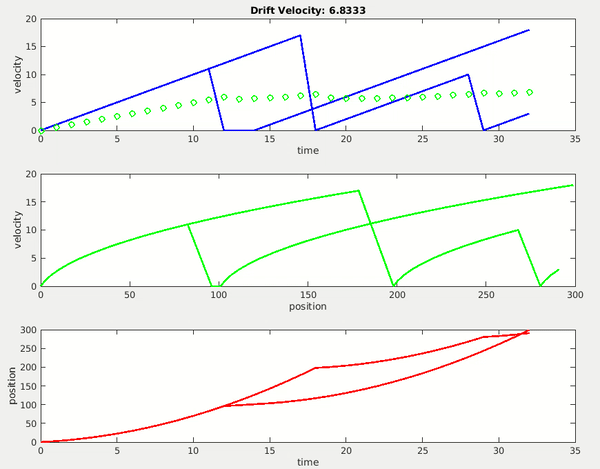

# ELEC 4700 Monte Carlo PA Assignment

1D particle (electron) acceleration simulation

## Usage

On the console run `MCElectronSim(1)`. The parameter is the number of electrons to simulate. Note that the script slows down considerably with each additional electron ¯\\_(ツ)_/¯ 